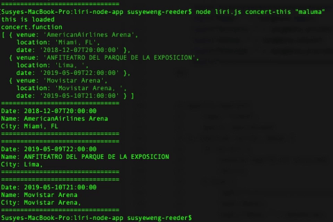
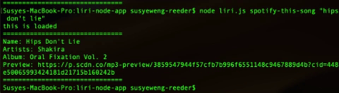

# liri-node-app

LIRI is a Language Interpretation and Recognition Interface. LIRI is a command line Node.js application that takes in certain parameters and gives you back data. LIRI recognizes four commands:  • concert-this  • spotify-this-song  • movie-this  • do-what-it-says

Command Format: "node liri.js", "a command it recognizes", and "artist/song/movie title"

## concert-this "artist/band name"

This parameter takes the band name entered and runs it through the bands in town API and returns concert information for that particular band. The following is logged in the terminal:
- Date of the Concert
- Venue Name
- Venue Location 

## spotify-this-song "song title"

This parameter takes the song title entered and runs it through the Spotify API. The following is logged to the terminal:
- Song Title
- Artist
- Album
- Spotify Preview Link

## movie-this "movie title"

This paramter takes the movie title entered and runs it through the OMDB API and returns the following information:
- Movie Title
- Year Released
- IMDB Rating
- Rotten Tomatoes Rating
- Countries Where Movie was Produced
- Language
- Plot
- Actors

## do-what-it-says "random text"

This parameter takes the information in the random.txt file and returns the following information:
- Name: I Want It That Way
- Artists: Backstreet Boys
- Album: The Hits--Chapter One
- Preview: https://p.scdn.co/mp3-preview/e72a05dc3f69c891e3390c3ceaa77fad02f6b5f6?cid=448e50065993424181d21715b160242b

# Technologies Utilized

- JavaScript
- Node.js
- Inquirer

## Author

- Susye Weng-Reeder - *JavaScript/ Node.js/ Inquirer* - [Susye Weng-Reeder](https://www.weng-reeder.com/ "Susye's Portfolio")
